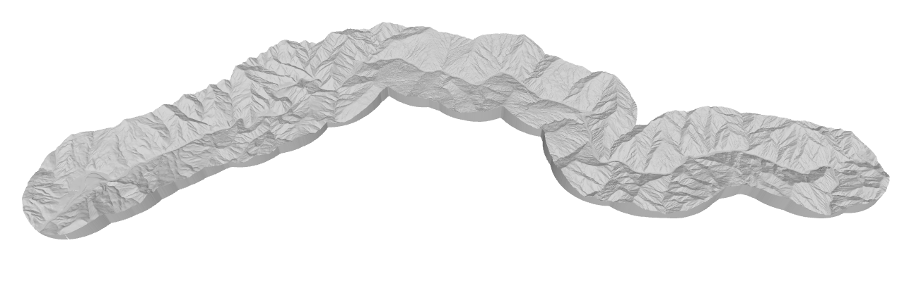

# River Canyon Heightmap 3D Model Maker

I started with the idea of being able to 3D print a heightmap of the Rogue River canyon. I decided to try to build a more general solution to this problem so that you could apply this to any river. In its current state it is a bit all over the place and not super clean. I may attempt to revisit this and create a webpage out of it for an easier-to-use user experience.

# TODOs

The main todos for this project at the point of the repo's creation
- [x] put all this stuff in a git repo
- [x] flip x direction (i think) (should do this at end of extract_elevations)
- [x] make the base (prolly my river following dots method)
- [ ] round edges
- [ ] think about doin holes for particular rapids/milestones
  - [ ] could do toothpick-sized holes
  - [ ] manual select for locations
- [ ] make a config file that can have all the settings in it
  - [ ] stuff to define in inches/mm in config

Heres some more todos that are lower priority but would be nice to do after i start the actual printing
- [ ] re-organize the scripts at some point
  - [ ] need a better way of passing the data between parts of the script
- [ ] make it run on a website so other people could use it (python webassembly probably)
  - [ ] make input/search boxes based on osm for selecting river, start/end points, and points of interest

# libraries
- rasterio
- overpy

# some links
https://www.openstreetmap.org/way/425061030#map=11/42.5708/-123.8434&layers=Y
using https://3dviewer.net/ for helping preview obj files

# notes

## for cutting in half
- try to do this incrementally and as soon as we remove half of the points, do that.
- get the line from start of river to end (this is our river-direction)
- generate rich verts again
- sort all verts (and triangles?) by how far they are along the river-direction
  - this can be used to more easily find points near plane-cutting surfaces
  - this can also be used to more easily find points to poke little holes in
  - could cache this and the other pre-calculations in a json file for faster iteration
- do hole-creation before doing plane-cutting
- find all the triangle edges that go thru our new plane
- now for each of those edges, do the following (for each side of our object)
  - take the vertex(s) that is past our plane and scoot it back to be exactly on our plane
  - for each vertex we scooted, remove all connections to triangles not in our new object
- now just need to grab all scooted vertices, and connect them as a polygon
  - scooting is prolly using something like this https://stackoverflow.com/questions/46978948/move-a-vertex-along-a-plane-given-the-plane-normal or https://stackoverflow.com/questions/9605556/how-to-project-a-point-onto-a-plane-in-3d
  - can find the right order by lookin thru neighbors for other vertices that got scooted (in clockwise triangle order)
  - probably connect these by creating a wall just like how we did for the edges
  - if we can do this and also create little nubs for structural connection that'd be great
- vector multiplication for lots of this probably